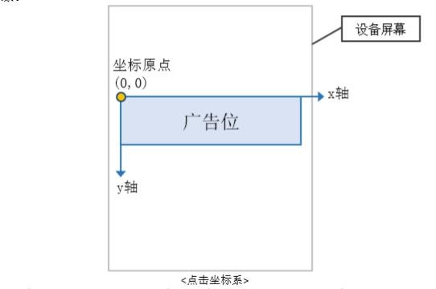

# SSP 对接文档协议

- [SSP 对接文档协议](#ssp-%E5%AF%B9%E6%8E%A5%E6%96%87%E6%A1%A3%E5%8D%8F%E8%AE%AE)
  - [文档说明](#%E6%96%87%E6%A1%A3%E8%AF%B4%E6%98%8E)
  - [接入准备](#%E6%8E%A5%E5%85%A5%E5%87%86%E5%A4%87)
  - [实时竞价流程](#%E5%AE%9E%E6%97%B6%E7%AB%9E%E4%BB%B7%E6%B5%81%E7%A8%8B)
  - [接入说明](#%E6%8E%A5%E5%85%A5%E8%AF%B4%E6%98%8E)
    - [请求 URL](#%E8%AF%B7%E6%B1%82-url)
    - [通信方式及编码](#%E9%80%9A%E4%BF%A1%E6%96%B9%E5%BC%8F%E5%8F%8A%E7%BC%96%E7%A0%81)
    - [请求头](#%E8%AF%B7%E6%B1%82%E5%A4%B4)
    - [竞价请求](#%E7%AB%9E%E4%BB%B7%E8%AF%B7%E6%B1%82)
      - [Request 字段信息](#request-%E5%AD%97%E6%AE%B5%E4%BF%A1%E6%81%AF)
        - [公共信息](#app-%E5%AF%B9%E8%B1%A1%E4%BF%A1%E6%81%AF)
        - [App 与 广告位信息](#site-%E5%AF%B9%E8%B1%A1%E4%BF%A1%E6%81%AF)
        - [Device 信息](#device-%E5%AF%B9%E8%B1%A1%E4%BF%A1%E6%81%AF)
    - [SSP 返回信息](#adx-%E8%BF%94%E5%9B%9E%E4%BF%A1%E6%81%AF)
      - [Response 字段信息](#response-%E5%AD%97%E6%AE%B5%E4%BF%A1%E6%81%AF)
        - [Ad 对象信息](#ad-%E5%AF%B9%E8%B1%A1%E4%BF%A1%E6%81%AF-1)
    - [上报地址宏替换信息](#%E4%B8%8A%E6%8A%A5%E5%9C%B0%E5%9D%80%E5%AE%8F%E6%9B%BF%E6%8D%A2%E4%BF%A1%E6%81%AF)

## 文档说明

此文档仅供开发者与传阅SSP使用 API 方式对接时使用

## 接入准备

见对接前需知

## 实时竞价流程
 
 TODO

## 接入说明 

### 请求 URL

当需要请求广告时，发送一个HTTP请求到下面的地址

测试环境地址：http://saad.ms.zhangyue.net:8080/ads/client

**正式环境地址：https://saad.ms.zhangyue.net/ads/client**

### 通信方式及编码

App 和 SSP 之间的基础通信协议采用 HTTP 协议、POST or GET 方法都支持，编码采用 UTF-8 编码。

**注意：**

如果使用HTTP POST，请以FORM表单形式发送数据。并且设置Content-type = application/x-www-form-urlencoded

### 请求头

| http 头信息段   | 说明                                                                                                                                                                                                                  |
| --------------- | --------------------------------------------------------------------------------------------------------------------------------------------------------------------------------------------------------------------- |
| User-Agent      | 移动设备的 User-Agent，从服务端使用非真实 User-Agent 会被视为问题流量。 例：“Mozilla/5.0 (iPad; CPU OS 5_0 like Mac OS X)， AppleWebKit/534.46 (KHTML， like Gecko)， Version/5.1 Mobile/9A334 Safari/7534.48.3”。 |

### 竞价请求

Request 请求是广告位请求广告的入口，由 App 按本文档中规定 URL 向 SSP 发送。

                                                                     
##### 公共信息

| 字段类型  | 类型     | 必须 | 描述                                                                                                                                |
| --------- | -------- | ---- | ----------------------------------------------------------------------------------------------------------------------------------- |
| ver       | string   | 是   | 本文档版本（3.1） |
| req_id    | string   | 否   | 请求唯一标识(具有唯一性,如不传 SSP 会自动给生成一个)|
| secure    | int      | 否   | 0 - 只支持 http 协议, 1	– 只支持 https 协议, 2 - 都支持。 不传时默认都支持|

##### app 与 广告位信息

| 字段类型  | 类型     | 必须 | 描述                                                                     |
| --------- | -------- | ---- | ---------------------------------------------------------------------- |
| pid           | int      | 是   | 广告位ID，在传阅SSP注册的时候申请          |
| app_id        | int      | 是   | App id，在传阅SSP平台注册的开发者应用ID    |
| app_name      | string   | 是   | App 名称                               |
| app_package   | string   | 是   | App bundle id，包名                     |
| app_ver       | string   | 是   | App 版本号                             |
 
##### Device 对象信息

| 字段名称         | 类型    | 必须 | 描述                                                                |
| --------------- | ------- | ---- | ----------------------------------------------------------------  |
| device_type       | string  | 是   | 设备类型（-1:未知, 0:phone, 1:pad, 2:pc, 3:tv 4:wap）             |                                         |
| device_make       | string  | 是   | 生产厂商，例如："HUAWEI"，“Samsung”                                         |
| device_model      | string  | 是   | 设备型号，例如 “iphoneA1530” "iPhone8"                                      |
| device_brand      | string  | 否   | 手机品牌，例如：“MI4”                                             |
| device_imei       | string  | 否   | IMEI 码。iOS 没有 (cdma 手机请传 meid 码)                         |
| device_oaid       | string  | 否   | 中国安全联盟定义的国内安卓设备唯一ID标识，iOS无需填写                |
| device_adid       | string  | 否   | 安卓为 android id, ios 则为 idfa                                 |
| device_openudid   | string  | 否   | 苹果设备唯一标识号; 安卓系统不必填写                                |
| device_idfv       | string  | 否   | ios idfv for iOS(>=iOS6) 安卓系统不必填写                         |
| device_mac        | string  | 否   | MAC 地址，                                                       |
| device_ua         | string  | 是   | User-Agent(须进行一次 url encode)必须是标准 Webview UA 而非自定义 UA |
| device_os         | string  | 是   | Android/iOS/WP/Others 字符串，注意大小写                          |
| device_type_os    | string  | 是   | 操作系统版本                                                      |
| device_dpi        | string  | 否   | 屏幕 dpi                                                         |                                                          |
| device_network    | int     | 是   | 网络类型，空串表示未知，（1：WIFI，2：4G，3：3G，4：2G，5：其他,6： 5G） |
| device_carrier    | int     | 是   | 网络运营商代码取值：46000(即中国移 动) 46001（即中国联通） 46003 （即中国电信）|
| device_orientation | int     | 是   | 设备方向，0：纵向，1：横向                                   |
| device_lan         | string  | 否   | 目前使用的语言国家 zh-CN                                    |
| device_geo_lat     | float   | 否   | GPS 纬度（-90-90）                                         |
| device_geo_lon     | float   | 否   | GPS 经度（-180-180）                                       |
| device_dpi         | int     | 否   | 像素密度，单位：每英寸像素个数                               |
| device_width       | int     | 是   | 水平分辨率，单位：像素                                      |
| device_height      | int     | 是   | 纵向分辨率，单位：像素                                      |
| device_ip      | string     | 否   | 客户端的公网ip，建议填写                                     |
| device_boot_mark      | string     | 否   | 阿里系客户需要的反作弊字段                                      |
| device_update_mark      | string     |否   | 阿里系客户需要的反作弊字段                                     |

                            

### SSP 返回信息

#### Response 字段信息

| 字段名称  | 类型        | 必须 | 描述                                                                  |
| -------- | ----------- | ---- | -------------------------------------------------------------------  |
| code     | int         | 是   | 返回结果，0：成功，其他 表示失败                                        |
| msg      | string      | 否   | 失败的话，会填写失败原因，例："网络错误"                                 |
| body     | Ad对象      | 否   | 如果失败，或者无对应广告则无此数据                                       |
 
##### Ad 对象信息

| 字段名称            | 类型     | 必须 | 描述 |
| ------------------ | -------- | ----| ---- |
| req_id             | string   | 是   | 应答对应的请求标识 |
| pid                | string   | 是   | 广告位 id，与 request 中的 pid 对应 |
| cid                | string   | 是   | ssp 平台创意 ID |
| ader_id            | string   | 是   | ssp 平台广告主 ID |
| width              | int      | 是   | 广告宽度 |
| height             | int      | 是   | 广告高度 |
| creative_type      | int      | 是   | 创意类型（1= :图片、2:视频、3：音频,4.gif）默认 1 |
| target_type        | int      | 是   | 广告动作类型，目标地址打开类型(0:网页跳转类,1:直接下载类) 默认值:0 |
| dUrl               | array    | 是   | 目标地址 |
| srcUrls            | array    | 是   | 物料图片地址URL |
| monitorUrl         | array    | 否   | 当广告被展示时被上报的监控 URL 列表 |
| clickUrl           | array    | 否   | 当点击广告时被上报的监控 URL 列表 |
| mzMurl             | array    | 否   | 秒针 sdk 曝光检测地址 |
| mzCurl             | array    | 否   | 秒针 sdk 点击检测地址 |
| deep_link          | string   | 否   | deep_link落地页地址（应优先唤醒deep_link,当无法唤醒deep_link时(如用户未安装相应app)再转而打开 dUrl 落地页） |
| app_name           | string   | 否   | 应用名称 下载类填写 |
| package_name       | string   | 否   | 对于 Android，是应用的 packageName；对于 iOS，是 Bundle identifier |
| title              | string   | 否   | 广告标题，图文广告时需要 |
| content            | string   | 否   | 广告描述，图文广告时需要 |
| icon               | string   | 否   | 角标（品牌 Logo、广告主头像等），图文广告时需要 |
| icon_title         | string   | 否   | 角标说明（品牌名、广告主名），图文广告时需要 |
| from               | string   | 否   | 广告来源 |
| full_screen        | int      | 是   | 开屏展现方式（1：全屏、2：半屏）不传客户端默认半屏 | 
| float_title        | string   | 是   | 浮层标题（只有开屏可能会带些字段 ） | 
| dn_start           | array | 否   | 下载类广告，下载开始时上报 |
| dn_succ            | array | 否   | 下载类广告，下载成功时上报 |
| dn_inst_start      | array | 否   | 下载类广告，安装开始时上报 |
| dn_inst_succ       | array | 否   | 下载类广告，安装成功时上报 |
| dn_active          | array | 否   | 下载类广告，安装完成并打开应用时上报 |
| deeplink_trackers        | string[]   |        | 否   | 吊起APP成功上报监测链接| 

 
### 上报地址宏替换信息

> 客户端在触发上报信息时，必须将点击追踪链接、点击跳转地址、点击关闭、播放开始、播放完成，展示中的宏变量替换上报（如有），单位为像素。需要替换的宏坐标如下：

| 宏变量                          | 类型  | 说明                                                                   |
| ------------------------------- | ----- | ---------------------------------------------------------------------- |
| `__DOWN_X__`     | int32 | 点击追踪链接、点击跳转地址中的点击落下 X 坐标                          |
| `__DOWN_Y__`     | int32 | 点击追踪链接、点击跳转地址中的点击落下 Y 坐标                          |
| `__UP_X__`       | int32 | 点击追踪链接、点击跳转地址中的点击离开 X 坐标                          |
| `__UP_Y__`       | int32 | 点击追踪链接、点击跳转地址中的点击离开 Y 坐标                          |                       

> 广告展示内容方向与屏幕方向一致时，广告位左上角为坐标（0，0）点，见下方示例。如果无法获取上述字段，需要将值替换为-999。

